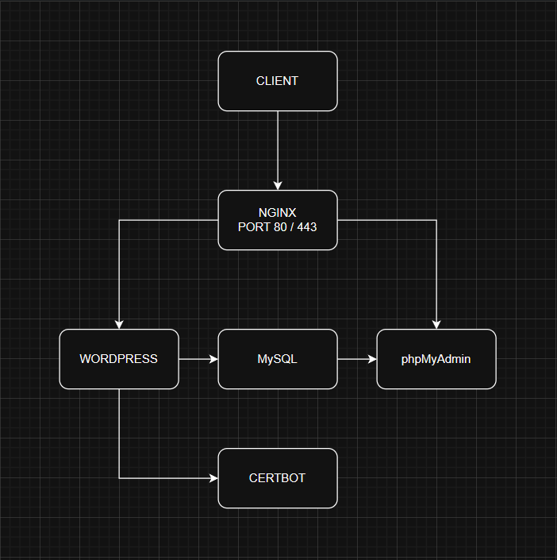

# Deploy WordPress, phpMyAdmin, Nginx, and SSL (Let's Encrypt) with Docker

This is a boilerplate for deploying a WordPress application easily using Docker Compose. This project includes Nginx as a reverse proxy, MySQL database, phpMyAdmin, and automatic SSL configuration using Certbot (Let's Encrypt).

## Key Features

- **WordPress**: A ready-to-use content management system (CMS).
- **Nginx**: Serves as a reverse proxy for WordPress and handles SSL termination.
- **MySQL**: Database for the WordPress installation.
- **phpMyAdmin**: A web-based tool for managing MySQL databases.
- **Certbot**: Automatically creates and renews SSL certificates from Let's Encrypt.

## Topology



## Directory Structure

```
.
├── certbot/
│   ├── conf/
│   └── www/
├── nginx/
│   ├── nginx.conf          # Used for initial SSL setup
│   └── nginx-ssl.conf      # Final configuration with SSL
├── .env
├── docker-compose.yml
└── README.md
```

## Prerequisites

Before starting, make sure you have:

1. **Docker** and **Docker Compose** installed on your server.
2. A **registered domain name** (e.g., `domain.com`).
3. A server (VPS) with a **public IP address** accessible from the internet.
4. A **DNS A record** for your domain pointing to the server’s public IP.

## Installation and Configuration Steps

Here is a complete guide to running this project from start to production.

### Step 1: Clone the Repository

```bash
git clone https://github.com/Rullabcde/nginx.git
```

### Step 2: Environment Configuration

The `.env` file stores all sensitive variables like database passwords and other configurations.

**a. Create the `.env` file:**

```bash
touch .env
```

**b. Fill the `.env` file with the following configuration and customize as needed.**

```env
# MySQL
MYSQL_ROOT_PASSWORD=your_root_password
MYSQL_DATABASE=wordpress_db
MYSQL_USER=wordpress_user
MYSQL_PASSWORD=your_password

# WordPress
WORDPRESS_DB_HOST=mysql:3306
WORDPRESS_DB_NAME=wordpress_db
WORDPRESS_DB_USER=wordpress_user
WORDPRESS_DB_PASSWORD=your_password

# phpMyAdmin
PMA_HOST=mysql
PMA_PORT=3306
PMA_ABSOLUTE_URI=https://domain.com/phpmyadmin
```

### Step 3: Generate SSL Certificate (Let's Encrypt)

This process requires Nginx to run temporarily on port 80 for domain validation by Certbot.

**a. Prepare Directories & Initial Nginx Configuration**

Create required directories for Certbot and Nginx.

```bash
mkdir -p ./certbot/conf ./certbot/www ./nginx
```

Copy the initial (HTTP-only) Nginx configuration from the template file in the repository.

```bash
# Copy content from `nginx/nginx.conf` available in this repository
cp nginx/nginx.conf nginx/nginx.conf
```

**b. Run Services for Domain Validation**

Run only the necessary services for the Certbot validation process.

```bash
# Run services without SSL
docker-compose up -d mysql wordpress phpmyadmin nginx
```

**c. Generate the SSL Certificate**

Run the `certbot` service to request an SSL certificate from Let’s Encrypt.

> **Important:**
>
> - Make sure to replace `email@gmail.com` and `domain.com` in the `docker-compose.yml` file under the `certbot` service.
> - Ensure your domain is correctly pointed to this server’s IP.
> - Ensure port 80 is accessible from the internet.

```bash
# Run certbot service to create the certificate
docker-compose run --rm certbot
```

**d. Verify Certificate**

Check if the certificate was successfully created in the expected directory.

```bash
ls -la ./certbot/conf/live/domain.com/
```

You should see `fullchain.pem` and `privkey.pem` files.

### Step 4: Configure Nginx with SSL and Launch the Application

After successfully obtaining the certificate, replace Nginx’s configuration to use SSL.

**a. Update Nginx Configuration for SSL**

Replace the `nginx.conf` file with the version that includes SSL.

```bash
# Overwrite Nginx configuration with the SSL version
cp nginx/nginx-ssl.conf nginx/nginx.conf
```

**b. Reload Nginx**

Apply the new configuration without restarting the container.

```bash
docker-compose exec nginx nginx -s reload
```

### Step 5: Setup Auto-Renewal for the Certificate

For production use, enable automatic renewal of SSL certificates.

**a. Modify `docker-compose.yml`**

Edit the `certbot` service in the `docker-compose.yml` file as shown below:

```yaml
certbot:
  image: certbot/certbot:latest
  container_name: certbot
  volumes:
    - ./certbot/conf:/etc/letsencrypt
    - ./certbot/www:/var/www/certbot
  # command: certonly --webroot -w /var/www/certbot --email email@gmail.com -d domain.com --agree-tos --no-eff-email # This line is commented out after the initial certificate creation
  # Enable entrypoint for auto-renewal every 12 hours
  entrypoint: /bin/sh -c "trap exit TERM; while :; do certbot renew; sleep 12h & wait $$!; done;"
  networks:
    - wp_network
```

**b. Apply Changes and Launch All Services**

```bash
# Relaunch all services with the updated configuration
docker-compose up -d
```

**c. Test Renewal Process (Optional)**

You can simulate the renewal process to verify everything is set up correctly.

```bash
docker-compose run --rm certbot renew --dry-run
```

## Setup Verification

Use the following commands to ensure everything is configured correctly.

```bash
# Test HTTP to HTTPS redirection
curl -I http://domain.com

# Test HTTPS connection
curl -I https://domain.com

# Inspect SSL certificate details
openssl s_client -connect domain.com:443 -servername domain.com

# Check certificate expiration date
docker run --rm -v $(pwd)/certbot/conf:/etc/letsencrypt certbot/certbot certificates
```

## Application Access

- **WordPress**: `https://domain.com`
- **phpMyAdmin**: `https://domain.com/phpmyadmin`

---
